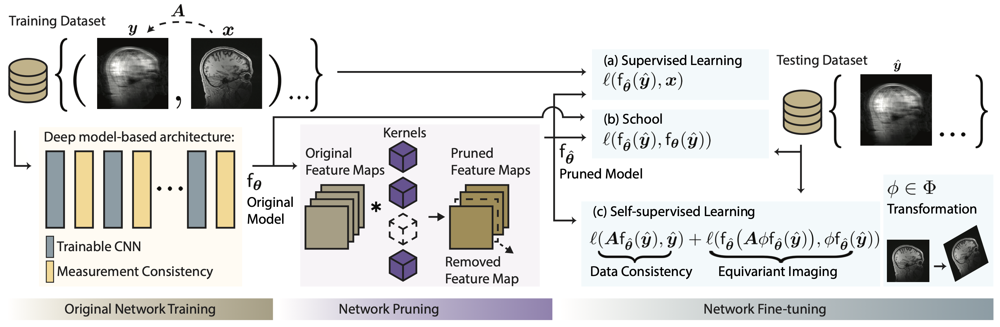

# [Efficient Model-Based Deep Learning via Network Pruning and Fine-Tuning](https://www.researchsquare.com/article/rs-5286110/v1)

[[Preprint]](https://www.researchsquare.com/article/rs-5286110/v1)

<!--  -->
<!--  -->
<!--


-->


## Abstract
Model-based deep learning (MBDL) is a powerful methodology for designing deep models to solve imaging inverse problems. MBDL networks can be seen as iterative algorithms that estimate the desired image using a physical measurement model and a learned image prior specified using a convolutional neural net (CNNs). The iterative nature of MBDL networks increases the test-time computational complexity, which limits their applicability in certain large-scale applications. Here we make two contributions to address this issue: First, we show how structured pruning can be adopted to reduce the number of parameters in MBDL networks. Second, we present three methods to fine-tune the pruned MBDL networks to mitigate potential performance loss. Each fine-tuning strategy has a unique benefit that depends on the presence of a pre-trained model and a high-quality ground truth. We show that our pruning and fine-tuning approach can accelerate image reconstruction using popular deep equilibrium learning (DEQ) and deep unfolding (DU) methods by 50% and 32%, respectively, with nearly no performance loss. This work thus offers a step forward for solving inverse problems by showing the potential of pruning to improve the scalability of MBDL.


## Environment setting

### 1) Clone the repository
```
git clone https://github.com/wustl-cig/MBDL_Pruning

cd MBDL_Pruning
```

### 2) Download fastMRI dataset

- Download **T2 Brain dataset** from [fastMRI dataset](https://fastmri.med.nyu.edu/). Test data will be released soon.

### 3) Download Pretrained Models


- Download **Deep Equilibrium Model (DEQ)** trained on the brain fastMRI dataset [Pretrained DEQ link](https://drive.google.com/file/d/1xAI3P8VJvZablVbm0i-6Ll7Iymmrr8Oj/view?usp=sharing). The default save directory is `./pretrained_models`.

- Download **End-to-End Variational Network (E2E-VarNet)** trained on the brain fastMRI dataset [Pretrained E2EVarNet link](https://drive.google.com/file/d/1xAI3P8VJvZablVbm0i-6Ll7Iymmrr8Oj/view?usp=sharing). The default save directory is `./pretrained_models`.

- Download **Variational Network (VarNet)** trained on the FFHQ 256x256 dataset [Pretrained VarNet link](https://drive.google.com/file/d/1xAI3P8VJvZablVbm0i-6Ll7Iymmrr8Oj/view?usp=sharing). The default save directory is `./pretrained_models`.

### 4) Virtual environment setup
```
conda env create -f MBDL_Pruning.yml

conda activate MBDL_Pruning
```

## Run experiment

### 1) Pick one task from `configs` directory:

#### Pruning and fine-tuning (self-supervised) the selected network

  - `configs/deq_configs.json`
  - `configs/e2evarnet_configs.json`
  - `configs/varnet_configs.json`

### 2) Execute the code

```
python main.py --task_config configs/{TASK_YAML_FILE_NAME}.yaml    # example code: python main.py --task_config configs/varnet_config.yaml
```

## Implementation detail

```
main.py                                # All high-level implementations of pruning and fine-tuning pipeline.
│   
└────────── Pruning_Finetuning.py      # All low-level implementations of pruning and fine-tuning pipeline.
```


<h2 style="color:red;">Troubleshooting</h2>

```diff
! If you encounter any issues, feel free to reach out via email at chicago@wustl.edu. 
```


## Code references

We adapt Torch-Pruning code structure from [Torch-Pruning repo](https://github.com/VainF/Torch-Pruning) to implement network pruning.

## Citation

```
@article{park2024EfficientMBDL,
	  title={Efficient Model-Based Deep Learning via Network Pruning and Fine-Tuning},
	  author={Park, Chicago Y.
		and Gan, Weijie
		and Zou, Zihao
		and Hu, Yuyang
		and Sun, Zhixin
		and Kamilov, Ulugbek S.},
	  journal={Research Square},
	  year={2024}
          doi={10.21203/rs.3.rs-5286110/v1}
	}
```
